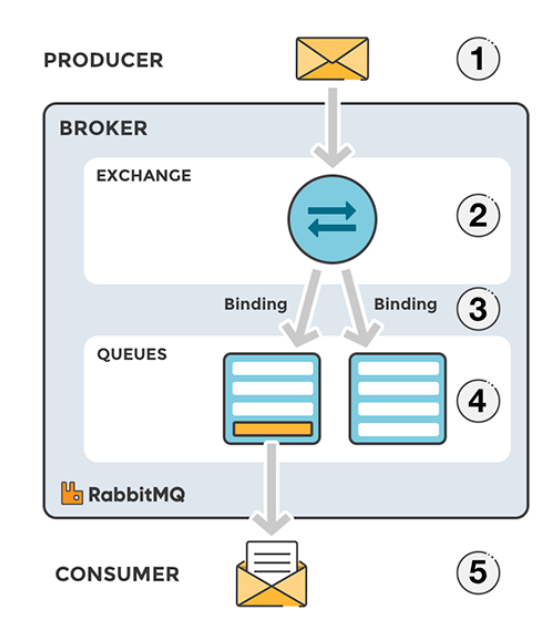
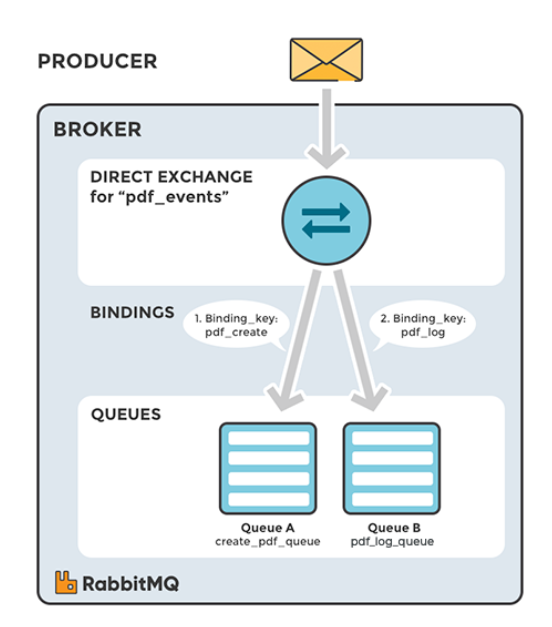
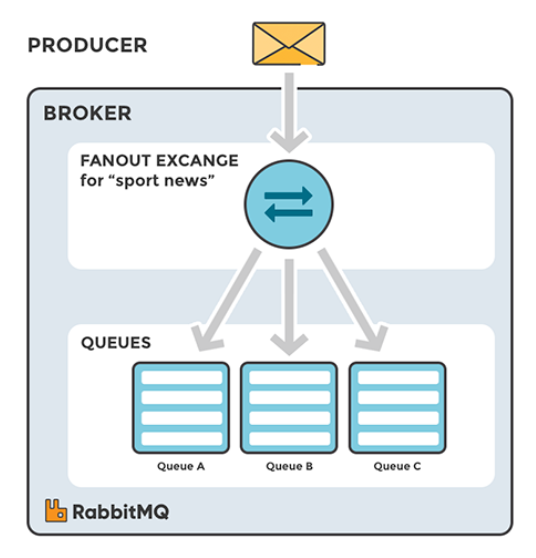
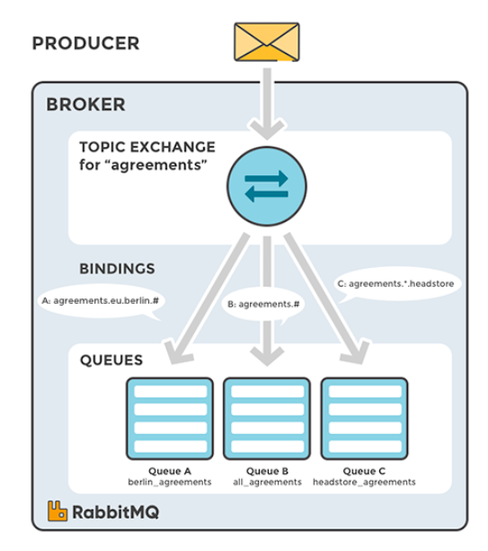
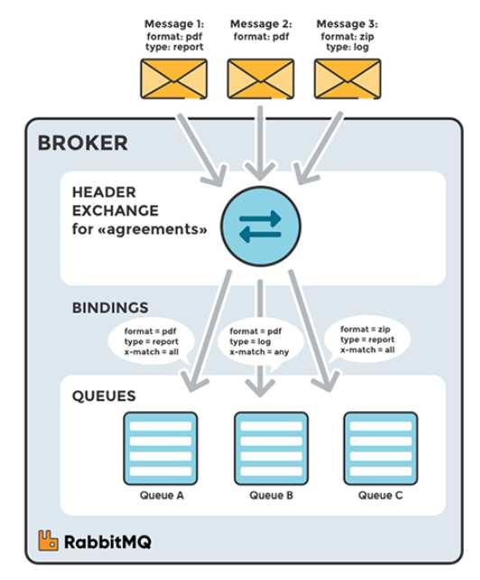

# Notes on Messaging protocols: AMQP, MQTT, STOMP, JMS, WebSockets

## Standard AMQP Messaging in RabbitMQ

## Message reception, processing and delivery within a distributed Architecture

## Exchangers
- Exchangers are the entry point for messages into the system. They are responsible for receiving messages from the producers/publishers and routing them to the appropriate queues.
- Exchangers can be configured to route messages to queues based on a number of criteria, including:
  - The routing key of the message
  - The type of the message
  - Headers in the message
  - The source of the message
- They can also be classified into different types:
  
  - Direct Exchangers
    - Messages are routed to queues based on the routing key of the message. Routing keys are key-value pairs that are part of the message header. The routing key is matched against the binding key of the queue. If they match, the message is routed to the queue.

      
  
  - Fanout Exchangers
      - Messages are routed to all the queues that are bound to the exchanger. The routing key is ignored in this case.
      
  
  - Topic Exchangers
    - Here, the routing key follows a specific naming pattern using wildcards and conventions. When the adequate routing key is found, the message will be sent to the corresponding queue.
      
  
  - Headers Exchangers
      - Messages are routed based on the headers in the message. The routing key is ignored in this case.
      
  
  - Default Exchangers
    - Messages are routed to the queue with the same name as the routing key. If no such queue exists, the message is discarded. Every exchanger is bound to a default queue with the same name as the exchanger.
        
  - Dead Letter Exchangers
      - Messages that are not delivered to the queue within a specified time are sent to a dead letter queue. This is useful for debugging purposes.
