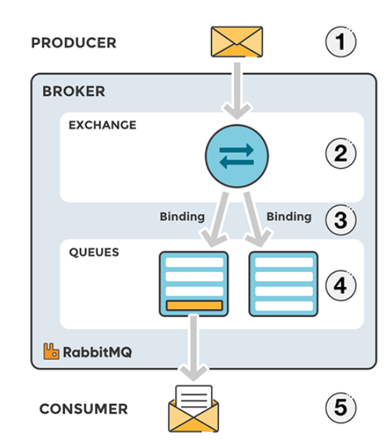
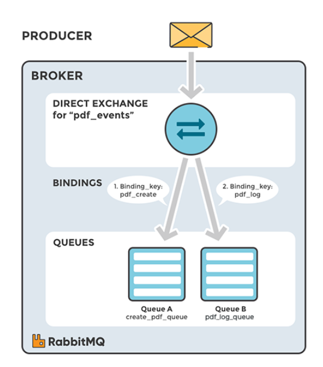

# Notes on Messaging protocols: AMQP, MQTT, STOMP, JMS, WebSockets

## Standard AMQP Messaging in RabbitMQ

## Message reception, processing and delivery within a distributed Architecture

## Exchangers
- Exchangers are the entry point for messages into the system. They are responsible for receiving messages from the producers/publishers and routing them to the appropriate queues.
- Exchangers can be configured to route messages to queues based on a number of criteria, including:
  - The routing key of the message
  - The type of the message
  - Headers in the message
  - The source of the message
- They can also be classified into different types:
  - Direct
    - Messages are routed to queues based on the routing key of the message. Routing keys are key-value pairs that are part of the message header. The routing key is matched against the binding key of the queue. If they match, the message is routed to the queue.
      
  - Fanout
  - Topic
    - 
  - Headers
  - Default
  - Dead Letter